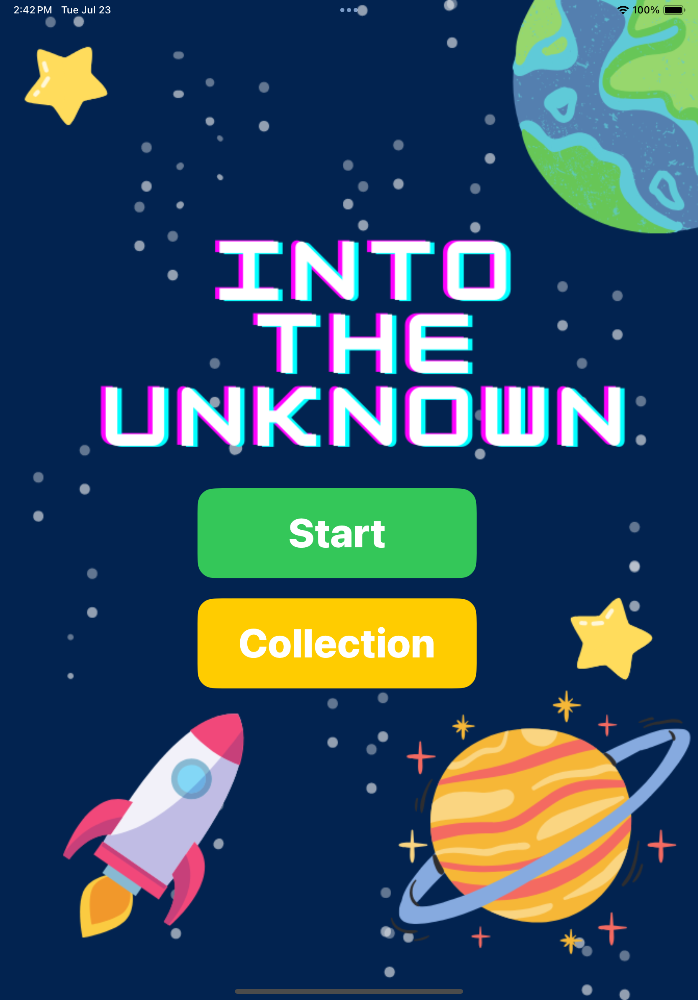
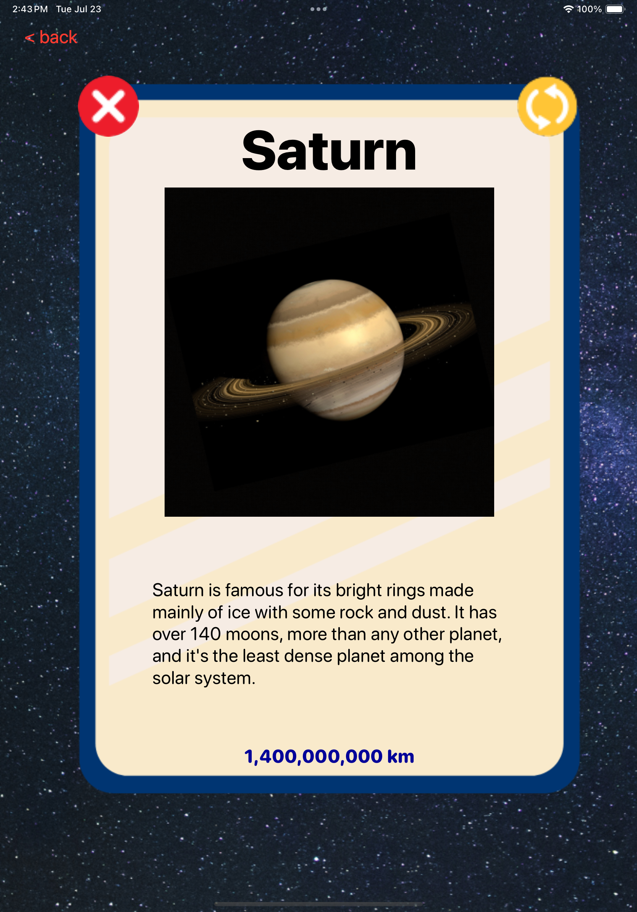
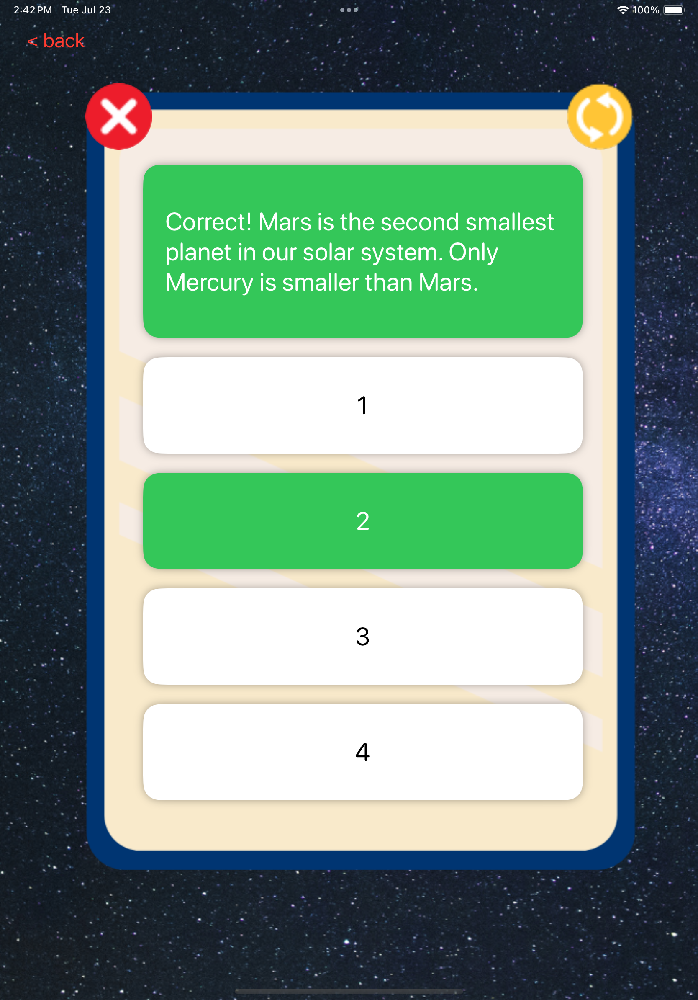
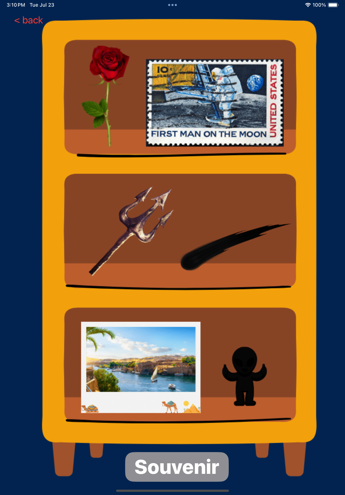

# Into the unknown

  
  
  
  
  
  

## About
A space education game designed to teach players about planetary distances and related knowledge.
## Technologies
- Swift
- SwiftUI
- AVFoundation
